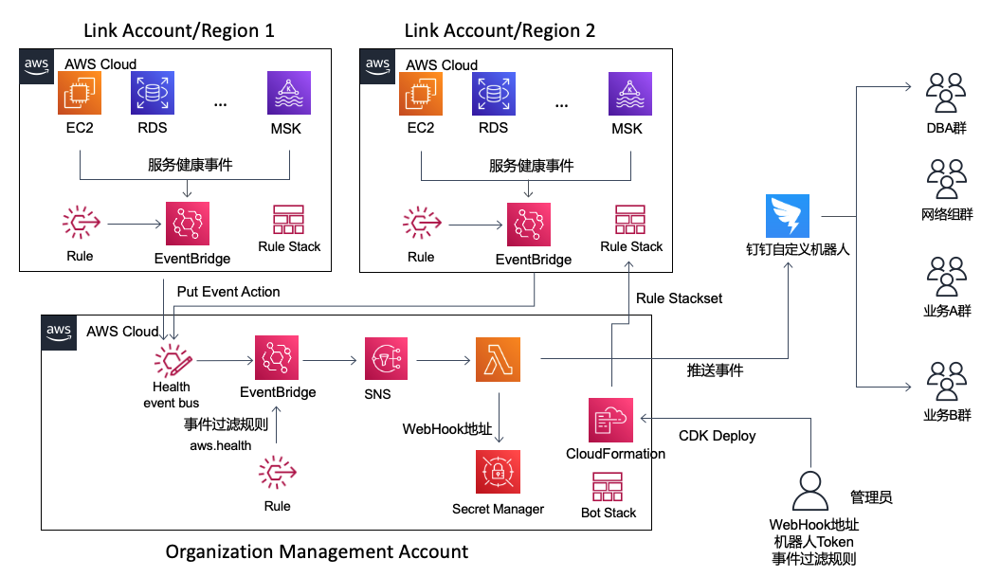

# 推送AWS服务健康及维护信息(Health Event)到企业通信工具消息机器人（IM robot）

---


## 背景信息
AWS通过Health Dashboard及Health API实时把AWS服务的健康事件，指定服务的维护事件及事件反馈给用户。本方案通过AWS Serverless服务把相关事件推送到企业通信工具机器人（IM robot）实现实时消息接入。

方案支持单地区部署和基于AWS Organization management account权限的多账号版本。当使用AWS账号及地区较少时，可使用单地区部署版本，仅在需要的账号及地区分别部署。

如果AWS环境使用很多的账号及地区，可使用多账号版本。多账号版本基于AWS Organization management account权限，使用Cloudformation Stackset完成多账号多地区自动部署。


## 阿里钉钉机器人版本 (Dingtalk)

### 消息样式
lambda采取markdown格式输出到钉钉机器人，消息样式如下：


### 创建钉钉机器人
根据钉钉开放平台文档接入自定义机器人。

参考文档：[自定义机器人接入](https://open.dingtalk.com/document/robots/custom-robot-access#title-zob-eyu-qse)

**注意保留钉钉机器人的WebHook地址以及对应的关键字（安全token）**

每个自定义机器人对应一个群，如果相同消息需要多群通知，需要创建多个机器人后端订阅相关消息。
### 单账号版本机器人后端架构图
单账号版本参考架构图如下：


#### 单账号版本机器人后端架构部署方式
单账号版本支持Serverless Application Module(SAM)和Cloud Development Kit(CDK)方式部署。


#### CDK 部署方式 (推荐方式)
单账号版本可通过AWS Cloud Development Kit (CDK)方式部署。

1. 安装CDK 环境
参考文档：[Installing the AWS CDK](https://docs.aws.amazon.com/cdk/v2/guide/getting_started.html)

2. 安装Golang环境
lambda代码采用golang开发，因此部署环境需要有golang编译环境。
lambda开发环境： go1.18.3 ,相对新的go版本都可以支持。

参考文档：[Download and install Golang](https://go.dev/doc/install)

3. 下载代码
从github上下载代码：

```
git clone https://github.com/zhang1980s/aws-event-bot.git
```

4. 部署单账号版本机器人后端架构 
```
cd cdk-single-account-dingtalk
./cdk-deploy-to.sh <ACCOUNT-NUMBER> <REGION> deploy --parameters "WebHook=https://oapi.dingtalk.com/robot/send?access_token=<xxx>" --parameters "BotSecretKey=<xxx>" --context groupName=<dingtalk-group-name>
```

如果目标账号的目标Region没有cdk[初始环境](https://docs.aws.amazon.com/cdk/v2/guide/bootstrapping.html)，部署前需执行下面命令进行CDK初始化。

```
cdk bootstrap aws://ACCOUNT-NUMBER/REGION
```
5. 测试机器人

**SNS消息测试**
```
aws sns publish --region <REGION> --topic-arn <SNS ARN> --message '{"version":"0","id":"99999999-9999-9999-9990-999999999999","detail-type":"AWS Health Event","source":"aws.health","account":"123456789012","time":"2016-06-05T06:27:57Z","region":"ap-southeast-2","resources":[],"detail":{"arn":"arn:aws:health:us-west-2::event/KAFKA/AWS_KAFKA_SECURITY_PATCHING_EVENT/AWS_KAFKA_SECURITY_PATCHING_EVENT_99999999-9999-9999-9999-999999999999","service":"KAFKA","eventTypeCode":"AWS_KAFKA_SECURITY_PATCHING_EVENT","eventTypeCategory":"scheduledChange","region":"us-west-2","startTime":"2023-03-09T23:00:00+08:00","endTime":"2023-03-10T03:00:00+08:00","lastUpdatedTime":"2023-03-02T23:02:12.808000+08:00","statusCode":"closed","eventScopeCode":"ACCOUNT_SPECIFIC"}}'
```

SNS ARN 可以从cdk部署完成输出中的SingleAccountDingTalkEventBotStack.SNSArn参数中获得。

**EventBus消息测试**
```
aws events put-events --region <REGION> --entries '[{"Source":"custom.dingtalkevent.test","DetailType":"CUSTOM","Detail":"{\"arn\": \"arn:aws:health:us-west-2::event/KAFKA/AWS_KAFKA_SECURITY_PATCHING_EVENT/AWS_KAFKA_SECURITY_PATCHING_EVENT_99999999-9999-9999-9999-999999999999\", \"service\": \"KAFKA\", \"eventTypeCode\": \"AWS_KAFKA_SECURITY_PATCHING_EVENT\", \"eventTypeCategory\": \"scheduledChange\", \"region\": \"us-west-2\", \"startTime\": \"2023-03-09T23:00:00+08:00\", \"endTime\": \"2023-03-10T03:00:00+08:00\", \"lastUpdatedTime\": \"2023-03-02T23:02:12.808000+08:00\", \"statusCode\": \"closed\", \"eventScopeCode\": \"ACCOUNT_SPECIFIC\"}","EventBusName":"default"}]' 
```

输入上述命令后，钉钉机器人会打印KAFKA维护信息到所在的群组中。

#### SAM部署方式
单账号版本可通过AWS Serverless Application Module（SAM）方式部署。

每个lambda应用（[lambda application](https://docs.aws.amazon.com/lambda/latest/dg/deploying-lambda-apps.html)）对应一个机器人部署，包含一个EventBridge rule, 一个SNS topic，一个lambda函数以及SecretManager中的一个Secret（架构图中的绿色部分）。


1. 安装SAM
参考文档：[Installing the AWS SAM CLI](https://docs.aws.amazon.com/serverless-application-model/latest/developerguide/install-sam-cli.html)


2. 安装Golang环境
lambda代码采用golang开发，因此部署环境需要有golang编译环境。
lambda开发环境： go1.18.3 ,相对新的go版本都可以支持。

参考文档：[Download and install Golang](https://go.dev/doc/install)

3. 下载代码
从github上下载代码：

```
git clone https://github.com/zhang1980s/aws-event-bot.git
```


4. 部署代码
通过sam cli部署代码

```
cd aws-event-bot/sam-single-account-dingtalk
sam build ; sam deploy --stack-name <应用名称> --parameter-overrides WebHook="<WebHook地址>" BotSecretKey="<关键字>" --region us-east-1
```

WebHook地址会被写入到SecretManager中做保存。Lambda会通过 WEBHOOK_SECRET_ARN环境变量获取到WebHook地址信息的ARN。

每个机器人都需要有个关键字（安全Token），这个关键字在部署后会被写入到lambda的BOT_SECRET_KEY环境变量中，lambda执行时会取出这个关键字加入到发送给钉钉的消息的题目中。因此WebHook地址和关键字两个参数必须在应用创建（sam deploy）时指定，否则lambda执行时会报错退出。

如果需要部署多个机器人负责推送不同类型的消息给对应的成员，例如（DBA消息机器人、安全消息机器人、指定业务消息机器人）,建议分别为每个机器人创建目录，并且分别把SAM模版及lambda代码放置在相关代码路径中以保证配置的独立性。


---
### 多账号版本机器人后端架构图



### 部署及配置方式


### 修改通知事件类型配置（可选）

设置机器人只接受特定类型的事件，需要通过定制EventBridge rule中的EventPattern来实现。修改位置在template.yml文件中的下面段落：

```
      EventPattern: {"detail-type": ["AWS Health Event"],"source": ["aws.health"]}
```

具体修改方式，可以参考EventBridge官方文档。

参考文档：[Build the event pattern](https://docs.aws.amazon.com/eventbridge/latest/userguide/eb-create-rule.html)


### 机器人AWS事件多群通知
每个钉钉群支持一个钉钉自定义机器人。可为每个群创建相应的自定义机器人并用群名称区分。

### 成本
TBD （可忽略不计的小成本）

### 下一步
1. 支持飞书
2. 支持企业微信
3. 支持更丰富的样式
4. Health API  高可用

