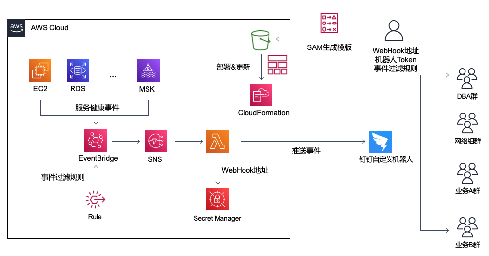

# 推送AWS服务健康及维护信息到阿里钉钉自定义机器人

---

### 背景信息

AWS通过Health Dashboard及Health API实时把AWS服务的健康事件，指定服务的维护事件及事件反馈给用户。本方案通过AWS Serverless服务把相关事件推送到阿里钉钉机器人实现实时消息接入。

### 架构图
方案参考架构图如下：


### 消息样式
lambda采取markdown格式输出到钉钉机器人，消息样式如下：


### 部署及配置方式
本方案采用AWS Serverless Application Module部署


1. 安装SAM
参考文档：[Installing the AWS SAM CLI](https://docs.aws.amazon.com/serverless-application-model/latest/developerguide/install-sam-cli.html)

2. 安装Golang环境
lambda代码采用golang开发，因此部署环境需要有golang编译环境。
lambda开发环境： go1.18.3 ,相对新的go版本都可以支持。
参考文档：[Download and install Golang](https://go.dev/doc/install)

3. 下载代码
从github上下载代码：

```
https://github.com/zhang1980s/aws-event-bot.git
```


4. 创建钉钉机器人
根据钉钉开放平台文档接入自定义机器人
参考文档：[自定义机器人接入](https://open.dingtalk.com/document/robots/custom-robot-access#title-zob-eyu-qse)

**注意保留钉钉机器人的WebHook地址以及对应的关键字（安全token）**

5. 部署代码
通过sam cli部署代码

```
cd dingtalk
sam build ; sam deploy --stack-name <应用名称> --stack--parameter-overrides WebHook="<WebHook地址>" BotSecretKey="<关键字>" --region us-east-1
```

如果需要部署多个机器人，例如（DBA消息机器人、安全消息机器人、指定业务消息机器人）建议分别创建每个机器人的目录，并且分别把部署代码及lambda代码放置在相关代码路径中以保证配置的独立性。

由于Health API默认的Endpoint是在us-east-1地区，不考虑高可用的场景下，本应用**必须**部署在us-east-1地区。

6. 修改配置（可选）

设置机器人只接受特定类型的事件，需要通过定制EventBridge rule中的EventPattern来实现。修改位置在template.yml文件中的下面段落：

```
      EventPattern: {"detail-type": ["AWS Health Event"],"source": ["aws.health"]}
```

具体修改方式，可以参考官方文档[Build the event pattern](https://docs.aws.amazon.com/eventbridge/latest/userguide/eb-create-rule.html)

7. 测试
可以通过把示例Health event发送到sns的方式测试机器人是否可以正常工作.

用部署好的SNS ARN替代示例中的SNS ARN
```
aws sns publish --region us-east-1 --topic-arn <SNS ARN> --message '{"version":"0","id":"99999999-9999-9999-9990-999999999999","detail-type":"AWS Health Event","source":"aws.health","account":"123456789012","time":"2016-06-05T06:27:57Z","region":"ap-southeast-2","resources":[],"detail":{"arn":"arn:aws:health:us-west-2::event/KAFKA/AWS_KAFKA_SECURITY_PATCHING_EVENT/AWS_KAFKA_SECURITY_PATCHING_EVENT_99999999-9999-9999-9999-999999999999","service":"KAFKA","eventTypeCode":"AWS_KAFKA_SECURITY_PATCHING_EVENT","eventTypeCategory":"scheduledChange","region":"us-west-2","startTime":"2023-03-09T23:00:00+08:00","endTime":"2023-03-10T03:00:00+08:00","lastUpdatedTime":"2023-03-02T23:02:12.808000+08:00","statusCode":"closed","eventScopeCode":"ACCOUNT_SPECIFIC"}}'
```

8. 把机器人拉入相关钉钉群
依据机器人可推送的事件属性加入相关群即可。

### 成本
TBD （可忽略不计的小成本）

### 下一步
1. 支持飞书
2. 支持企业微信
3. 支持更丰富的样式
4. Health API  高可用

